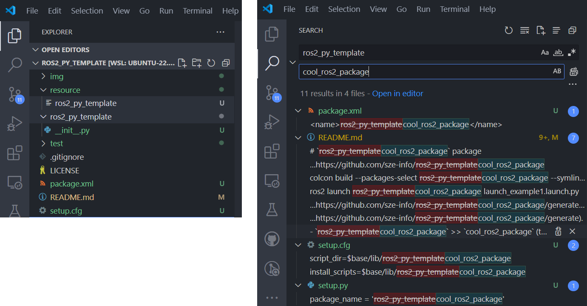

# `ros2_py_template` package
ROS 2 python package.  [](https://docs.ros.org/en/humble/)

A package egy node-ból áll, ez a turtlesim szimulátorban képes a trajektóra kirajzolásával egy "Négy lyukú híd alakzat" előállítására. A hirdetett topic `geometry_msgs/twist` típusú. Megvalósítás `ROS 2 Humble` alatt.

This package consist of one node. This can draw a "four hole bridge shape" in a turtlesim simulator. The type of the published topic is 'geometry-msgs/twist'. The implementation is builted in 'ROS 2 Humble'.

## Packages and build

It is assumed that the workspace is `~/ros2_ws/`.

### Clone the packages
``` r
cd ~/ros2_ws/src
```
``` r
git clone https://github.com/sze-info/ros2_py_template
```

### Build ROS 2 packages
``` r
cd ~/ros2_ws
```
``` r
colcon build --packages-select ros2_py_template --symlink-install
```

<details>
<summary> Don't forget to source before ROS commands.</summary>

``` bash
source ~/ros2_ws/install/setup.bash
```
</details>

``` r
ros2 launch ros2_py_template launch_example1.launch.py
```

flowchart TD

U([bridgedraw.py]):::red -->  CMD[ /turtle1/cmd_vel<br/>geometry_msgs/Twist]:::light --> S([turtlesim_node]):::red

classDef light fill:#34aec5,stroke:#152742,stroke-width:2px,color:#152742  
classDef dark fill:#152742,stroke:#34aec5,stroke-width:2px,color:#34aec5
classDef white fill:#ffffff,stroke:#152742,stroke-width:2px,color:#152742
classDef red fill:#ef4638,stroke:#152742,stroke-width:2px,color:#fff


# Delete this part if you are using it as a template

ROS 2 pacage template, to get started, use template by clicking on the Green button labeled [`Use this template`](https://github.com/sze-info/ros2_py_template/generate) / [`Create new repository`](https://github.com/sze-info/ros2_py_template/generate). 

<p align="center"></p>


Let's assume 
- your Github username is `mycoolusername`
- your ROS 2 repo shold be `cool_ros2_package`

Replace everything in the cloned repo:

- `ros2_py_template` >> `cool_ros2_package` (the folder was already renamed after `Use this template`)
- `sze-info` >> `mycoolusername`
- find all `todo` strings and fill the blanks

The easiest way is VS code:

<p align="center"></p>

> [!IMPORTANT]  
> Don't forget to rename the directory (folder) and the file too.

Now `colcon build` your ROS 2 package and you can start wokring.
